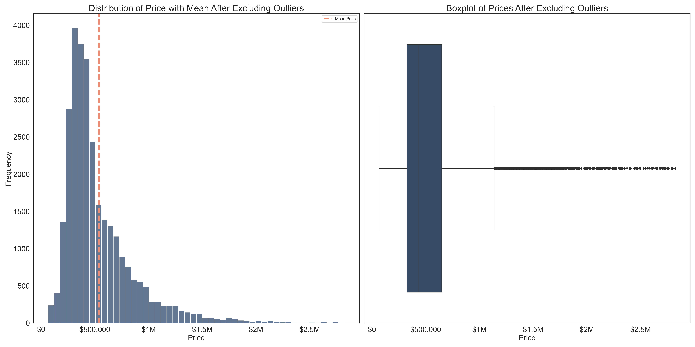
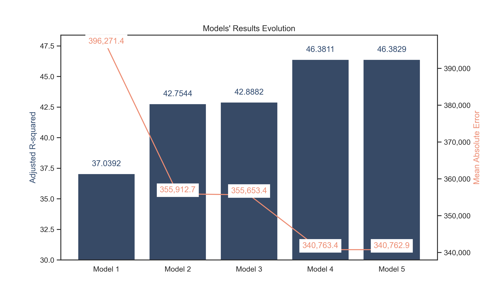

# King County Real Estate
<p align="center">

</p>
## 1. Overview

This notebook examines King County, WA dataset of houses and reviews how and what renovations add value to a house's sale price.

## 2. Business Problem

The goal is to provide advice to homeowners about how home renovations might increase the estimated value of their homes, and by what amount.

## 3. Data Understanding

This dataset contains information about house sales in King County WA. It includes the following columns:
* `id` - Unique identifier for a house
* `date` - Date house was sold
* `price` - Sale price. This criteria will be the prediction target.
* `bedrooms` - Number of bedrooms
* `bathrooms` - Number of bathrooms
* `sqft_living` - Square footage of living space in the house
* `sqft_lot` - Square footage of the lot
* `floors` - Number of floors in house
* `waterfront` - Indicates if the house is on a waterfront
* `greenbelt` - Indicates if the house is near to an area of open natural, undeveloped land
* `nuisance` - Indicates if the house has traffic noise or other nuisances
* `view` - Quality of view from house
* `condition` - Overall condition of the house
* `grade` - Overall grade of the house
* `heat_source` - Heat source for the house
* `sewer_system` - Sewer system for the house
* `sqft_above` - Square footage of house apart from basement
* `sqft_basement` - Square footage of the basement
* `sqft_garage` - Square footage of garage space
* `sqft_patio` - Square footage of outdoor porch or deck space
* `yr_built` - Year when house was built
* `yr_renovated` - Year when house was renovated
* `address` - Street address
* `lat` - Latitude coordinate
* `long` - Longitude coordinate


## 4. Modeling
The dependent, or target variable is a house's selling price. Some of the dataset was removed to focus solely on those pertaining to features that can have renovations.     
After an initial visualization of the dataset's distribution, as well as a first simple linear regression, the price outliers were removed. 

Outliers were excluded outside of the 5th percentile both at the lower and upper limit. 




Three main models of regression were created. 
1. Simple linear regression predicting a house's sale price based on its square footage of living area 
2. Multiple linear regression predicting price based on:
    * square footage of living area 
    * the house's condition (ranking)
3. Multiple linear regression predicting price based on numeric features:
    * number of bedrooms
    * number of bathrooms
    * square footage of living area
    * number of floors in the house 
    * square footage apart from basement
    * square footage of basement
    * square footage of garage space
    * square footage of outdoor porch or deck space
    * year when the house was built

## 5. Regression Results

The last model's results showed the best fit. Despite recording very close results compared to the initial multilinear regression model, a few statistics show improvement of the model: 

1. **Adjusted R-squared**: the new adjusted r-squared shows a small improvement with a value of 0.46382942067496613 as opposed to 0.46381145072171526. 46.4% of the model's explanatory power is a little stronger than the previous one.

2. **F-statistic and Prob (F-statistic)**: the F-statistic value increased to 2866 from 2579 with a p-value remaining at 0. This indicates that at least one independent variable in the model has an even stronger impact on the price than the previous model.  
    
3. **Coefficients and P-values (P>|t|)**: each coefficient represents the change in price for a one-unit change in the corresponding numeric, independent variable, while holding other variables constant. The p-values associated with them test the null hypothesis that the variable has a statistically significant impact on the dependent variable. All p-values were at 0, confirming the statistically significant impact of each feature on price. 

   - "bathrooms": adding one bathroom to the house is associated with an increase of \$116,200 on the sale price 
   - "sqft_living": an increase of one square foot in living area is associated with an increase of \$303.26 on the sale price 
   - "floors": adding one floor to a house is associated with an increase of \$33,9000 on the sale price 
   - "sqft_above": an increase of one square foot in the above area is associated with an increase of \$202.70 on the sale price 
   - "sqft_basement": an increase of one square foot in the basement area is associated with an increase of \$101.19 on the sale price 
   - "sqft_patio": an increase of one square foot in the outdoor area is associated with an increase of \$159.91 on the sale price 


4. **Condition no.**: although still high (313,000), this is a considerable improvement compared to the 5,280,000 recorded on the previous model. The risk of multicollinearity among the independent variables is now lower, improving the model's validity.

<u>Limits</u> 
1. **Jarque-Bera, and Kurtosis**: both statistics slightly increased on this new model, suggesting that removing "sqft_lot" worsened the distribution of the dataset, which was already not normal. The slightly higher Kurtosis (11.598 vs 11.597) indicates slightly heavier tails. 


In summary, this final regression analysis indicates that the model has the most explanatory power among all models. The features having the most impact on sales price are bathrooms, sqft_living, floors, sqft_above, sqft_garage and sqft_patio. 
On the other hand, an increase in bedrooms sqft_garage and yr_built seem to lower the sale price. This may suggest that in order to increase the square footage of living area, the garage could be reduced or a bedroom could be turned into a larger living room to sell a house at a higher price. 

A deeper analysis by house type should be conducted to confirm this hypothesis.


Nevertheless, there may be issues with the main assumptions of a multiple linear regression regarding the fact that the dataset is not normally distributed, as well as multicollinearity of certain independent variables. 




## 6. Recommendations

The last model returned the best results to draw the below conclusions. As a real-estate, to improve your house's sale price:

### 1. Square Footage of Living Area 
    Focus on increasing the square footage of the living area. This may mean by reducing the space of your garage, basement, outdoor space, or by suppressing a bedroom if its size is not sufficient. 
    An increase of one square foot in living area is associated with an increase of $303.26 on the sale price

### 2. Very Good Condition
    Aim for a very good condition
    Properties with a "Very Good" condition are associated with an increase of $135,700 in price

### 3. Bathroom 
    Add one bathroom If costs and water inlet permit it.
    Adding one bathroom to the house is associated with an increase of $116,200 on the sale price

### 4. Floor 
    Add one floor If your house has high ceilings. Consider a mezzanine if height is limited
    Adding one floor to a house is associated with an increase of $33,9000 on the sale price


## 7. Limits 

The last multiple linear regression results confirmed the findings of each model:

* the dataset does not have a normal distribution
* There is a rather risk of multicollinearity among the independent variables
Both findings present a risk on the model's assumptions and may question its validity.

## 8. Next Steps
The dataset could be transformed into a normal distribution in order to ensure a better fit. In addition, scaling the data could improve predictions, and reducing the Mean Absolute Error.

To address the risk of multicollinearity, some variables could be removed or grouped together.


## For More Information 
See the full analysis and code in the [Jupyter Notebook](notebook.pdf) as well as summary in this [presentation](presentation.pdf).


For additional info, contact [Albane Colmenares](mailto:albane.colmenares@gmail.com?subject=[GitHub]%20Source%20Han%20Sans)

## Repository Structure
```
├── images
├── .gitignore
├── README.md
├── KC-real-estate.ipynb
├── presentation.pdf
└── notebook.pdf

```
